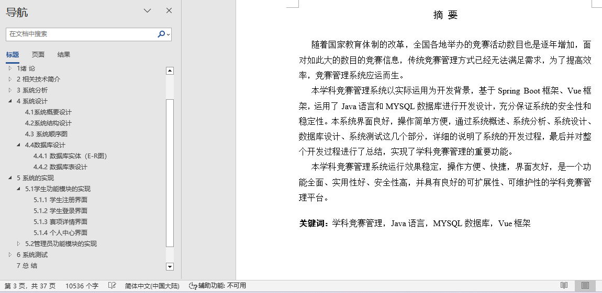
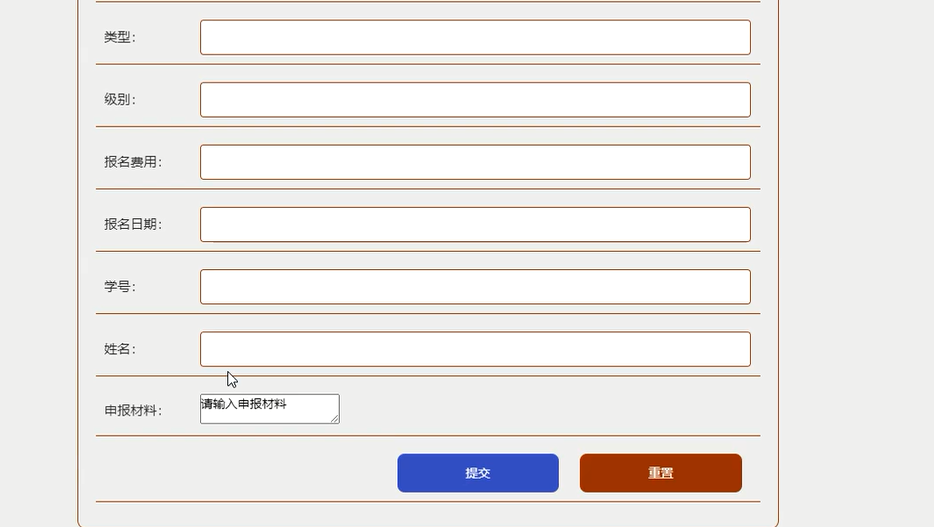
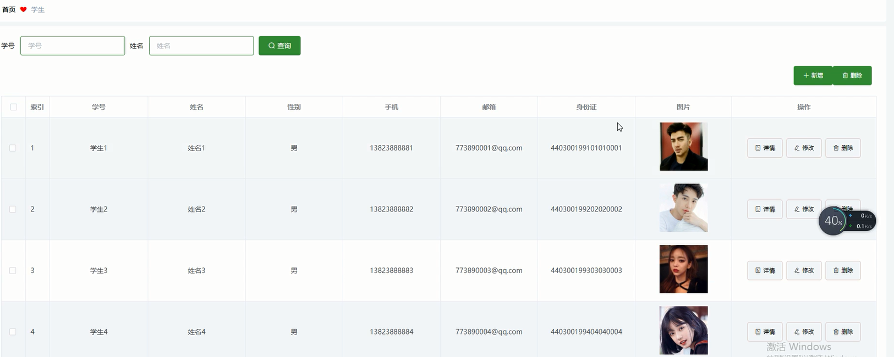
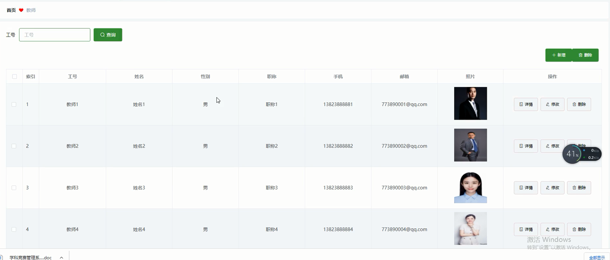
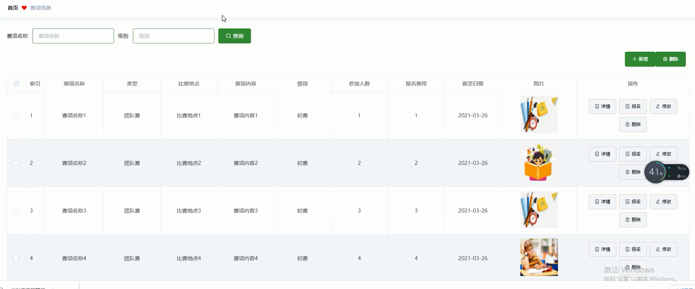
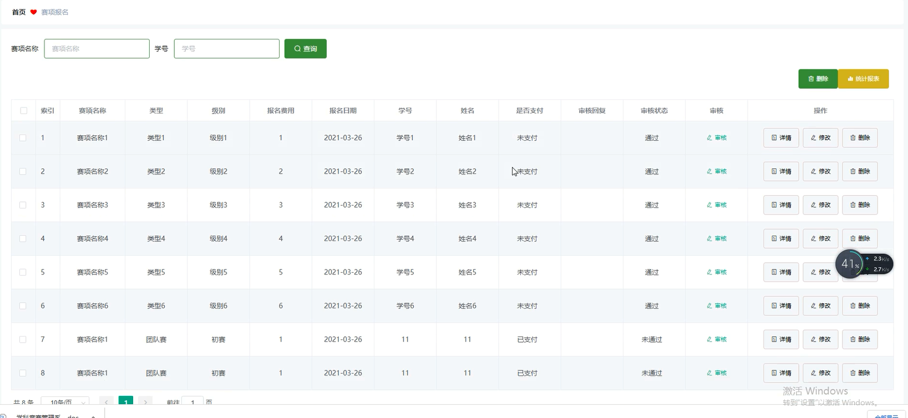
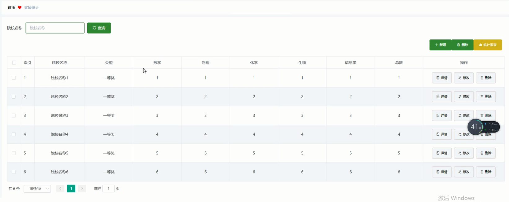
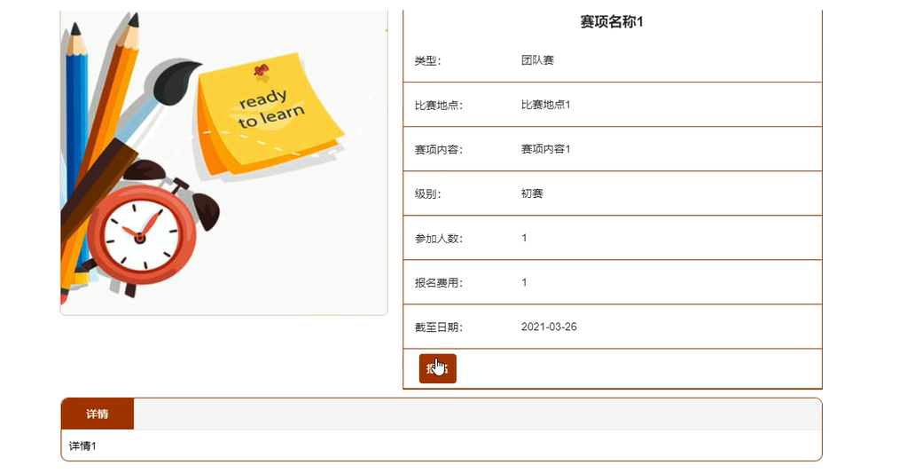

## 学科竞赛管理系统(程序+报告)

- <b>完整代码获取地址：从戎源码网 ([https://armycodes.com/](https://armycodes.com/))</b>
- <b>技术探讨、资料分享，请加QQ群：692619798</b> 
- <b>作者微信：19941326836  QQ：952045282</b> 
- <b>承接计算机毕业设计、Java毕业设计、Python毕业设计、深度学习、机器学习</b>
- <b>选题+开题报告+任务书+程序定制+安装调试+论文+答辩ppt 一条龙服务</b>
- <b>所有选题地址 ([https://github.com/YuLin-Coder/AllProjectCatalog](https://github.com/YuLin-Coder/AllProjectCatalog)) </b>

## 项目介绍
学科竞赛管理系统，系统包含两种角色：用户、管理员，系统分为前台和后台两大模块，主要功能如下：

1 学生功能模块的实现

系统主界面
学生进入系统后可查看系统信息，展示主界面。

学生注册界面
没有账号的学生用户可进行注册操作。

学生登录界面
学生在登录时需输入正确的登录用户名和密码，系统会验证登录信息，信息正确则登录成功，反之登录失败。

赛项详情界面
学生可选择赛项查看详情信息，登录后可进行报名操作，展示报名界面。

个人中心界面
学生可对个人信息进行修改。

2管理员功能模块的实现

管理员登录界面
管理员要进入后台进行管理操作，需先登录系统后台。

学生管理界面
管理员在学生管理界面可查看所有学生信息，并可进行修改和删除操作，同时也可添加学生信息。

教师管理界面
管理员可增删改查教师信息。

赛项信息管理界面
管理员可增删改查赛项信息。

赛项报名管理界面
管理员可查看所有赛项报名信息，并可对其进行审核、修改和删除操作。

奖项统计管理界面
管理员可增删改查奖项统计信息。

## 项目技术
- 编程语言：Java
- 数据库：MySQL
- 项目管理工具：Maven
- 前端技术：HTML、CSS、JavaScript、Vue
- 后端技术：Spring、SpringMVC、MyBatis

## 运行环境
- JDK版本：JDK1.8及以上
- 开发工具：IDEA、Ecplise、Myecplise都可以
- 数据库: MySQL5.7及以上
- Maven：maven3.0及以上
- Node：14.14.0及以上

## 运行截图

